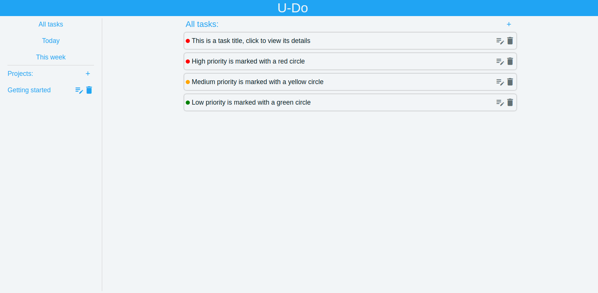
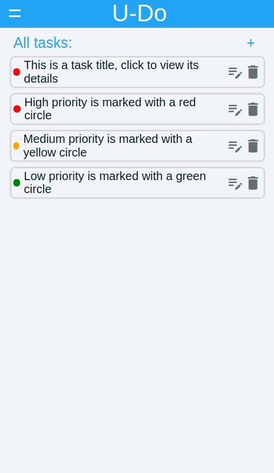

# About

**U-Do** is a Todo list web app with a clean UI that helps users keep their notes organized.

It displays tasks ordered by the date they're due to be completed, while giving users the option to view all the tasks, or just those of the day (or week), so that there's less clutter and it's always clear what needs to be done next.
Users can also assign priorities to each task, so the most important ones are always highlighted.

U-Do offers the ability to group related tasks into projects, and the ability to display the tasks of a selected project, for even easier sorting. And it has localStorage support, so the tasks and projects don't get erased on closing the page.

## Built with

This app is built without using any frameworks, only:

- HTML
- CSS
- JavaScript

## [
--- Live preview ---
](https://liridonloku.github.io/todo/)

# Screenshots
## Desktop view:

## Mobile view:

# Usage

This app is simple to use:

- Use the + button above the tasks to add a new task
- Use the + button above the projects to add a new project
- When creating or editing tasks, users can select a project to assign them to, from the list of projects that they have created.
- Use the edit and delete buttons to edit/delete tasks or projects

# Roadmap

## Known issues
- The app remembers the last selected view, so that when the user triggers a reload by adding a new task the view doesn't change. This doesn't work if the last selected view is a project.
- I've used a custom function to assign ID's to each task and project, but I have concerns about its performance once there's a large number of entries. This needs to be handled with a UID function.

## Features for future versions

- Ability to mark tasks as done without deleting them
- Ability to add subtasks
- Dark mode
- Improved UI/UX on mobile devices

# Contact

Liridon Loku - liridonloku@gmail.com

# Acknowledgements

- [The Odin Project](https://theodinproject.com) - an amazing curriculum and community.
- [Date-fns](https://date-fns.org/)
- [Webpack](https://webpack.js.org/)
- [Google material icons](https://fonts.google.com/icons)

